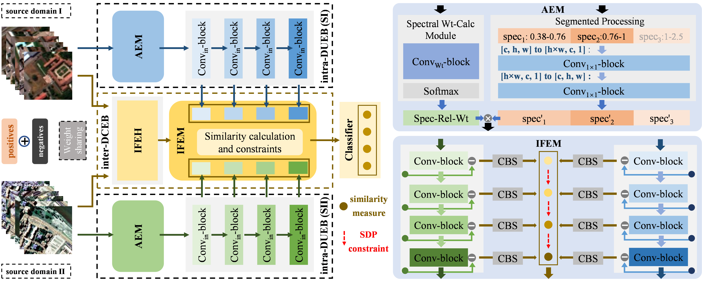

# MDGTnet

[Multi-Source Domain Generalization Two-Branch Network for Hyperspectral Image Cross-Domain Classification](https://ieeexplore.ieee.org/document/10410893)

[Yunxiao Qi](https://ieeexplore.ieee.org/author/37090046528); [Junping Zhang](https://ieeexplore.ieee.org/author/37293675400); [Dongyang Liu](https://ieeexplore.ieee.org/author/37089208447); [Ye Zhang](https://ieeexplore.ieee.org/author/37279965600)

## Requirements

This code is based on **Python 3.10** and **Pytorch 1.12**.

Installation list:

· pytorch 

· matplotlib

· opencv-python

· scipy

· h5py

· tqdm

· scikit-learn

## Models

**· SD--H13+H18 :** model9.pth

**· SD--PU+PC :** model9.pth

## Datasets

**raw:** Houston 2013 / Houston 2018 / PaviaU / PaviaC

**H13+H18 -- PU/PC :**

**PU+PC -- H13+H18 :**

## Getting start

#### 中文版本

#### ENGLISH VERSION

